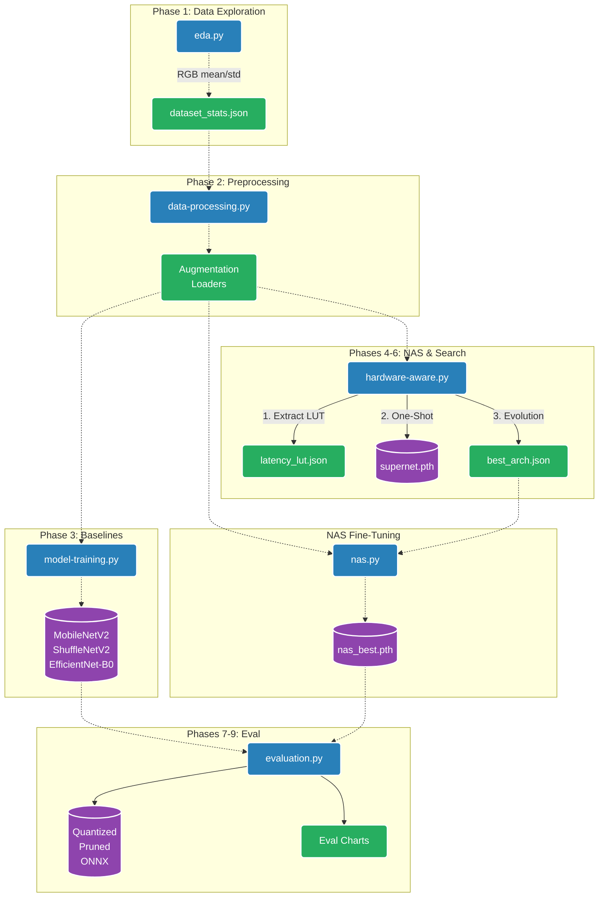

# Hardware-Aware NAS for Edge Devices — Scripts Overview

This directory contains the core Python scripts for the Hardware-Aware Neural Architecture Search (NAS) project on the Tiny-ImageNet-200 dataset. The workflow is divided into 9 logical phases, spanning from data exploration to model search, fine-tuning, and final edge-device optimization.

## System Architecture & Workflow Diagram

## Scripts Description

| Script                   | Purpose                                                                                                                                                                                                                                 | Key Outputs                                                              |
| :----------------------- | :-------------------------------------------------------------------------------------------------------------------------------------------------------------------------------------------------------------------------------------- | :----------------------------------------------------------------------- |
| **`eda.py`**             | **Phase 1:** Dataset integrity checks, class distribution, and pixel intensity statistics. Computes the normalization factors (mean/std).                                                                                               | `dataset_stats.json`, EDA plots                                          |
| **`data-processing.py`** | **Phase 2:** Defines the standard data augmentation strategy (Crop, Flip, Jitter, Erase) and creates efficient PyTorch DataLoaders.                                                                                                     | `augmentation_preview.png`, `dataloader_benchmark.json`                  |
| **`model-training.py`**  | **Phase 3:** Trains standard lightweight baselines (MobileNetV2, ShuffleNetV2, EfficientNet-B0) to serve as reference points.                                                                                                           | `{baseline}_best.pth`, baseline metrics & plots                          |
| **`hardware-aware.py`**  | **Phases 4–6:** The core NAS algorithm. Defines the cell-based search space, builds a latency lookup table (LUT), trains a One-Shot Supernet, and runs an Evolutionary Search to find the optimal architecture within a latency budget. | `latency_lut.json`, `supernet_final.pth`, `best_arch.json`, Pareto front |
| **`nas.py`**             | **NAS Extraction & Fine-tuning:** Takes the optimal architecture (`best_arch.json`), instantiates it as a leaner standalone model, and trains it from scratch to convergence.                                                           | `nas_best_finetuned.pth`                                                 |
| **`evaluation.py`**      | **Phases 7–9:** Final optimization and benchmark. Applies Post-Training Quantization (INT8), Magnitude Pruning, exports to ONNX, and benchmarks all models (baselines + NAS) generating final comparative charts.                       | Quantized/ONNX models, `final_comparison.json`, scatter/bubble charts    |

## Usage Pipeline

To reproduce the entire pipeline, execute the scripts sequentially:

1. `python eda.py`
2. `python data-processing.py`
3. `python model-training.py`
4. `python hardware-aware.py`
5. `python nas.py`
6. `python evaluation.py`
